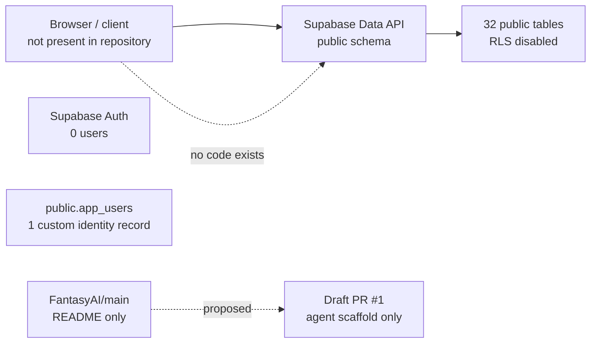
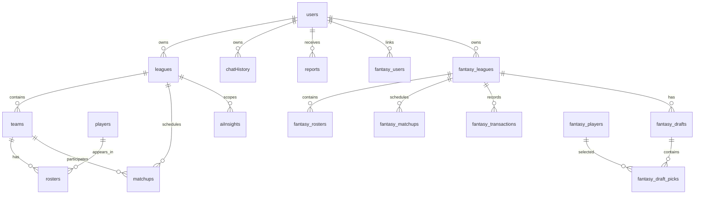

# FantasyAI + SOA.GM live technical audit

**Audited:** 2026-07-24  
**Scope:** `ntatum/FantasyAI` (`main` and open PR #1) and Supabase project `SOA.GM` (`goaesfbsaosannvwvwdg`).  
**Method:** direct GitHub and Supabase inspection only. No conclusions below rely on an assumed application implementation.

## Executive summary

The Supabase project contains an unpopulated, two-generation fantasy-sports schema, but `FantasyAI/main` contains only `README.md` (`# FantasyAI`). There is no application source, package manifest, build configuration, CI, migration directory, frontend, API layer, tests, or deployment configuration in the default branch. Draft PR #1 adds an AI-delivery scaffold but has not been merged or deployed.

The immediate production risk is database exposure: all **32 public application tables** have RLS disabled and no policies; `anon` and `authenticated` each have `SELECT`, `INSERT`, `UPDATE`, `DELETE`, and `TRUNCATE` grants on all of them. The Supabase Security Advisor reports 32 ERROR-level findings for exactly this condition. The schema has no recorded migrations, no database functions/triggers/views, no Edge Functions, no Storage buckets, and no application Auth users.

**Release verdict: do not launch.** Security is P0; product completion is effectively 0% because no runnable application exists in the system of record.

## Evidence snapshot

| Area | Direct evidence | Assessment |
|---|---|---|
| GitHub baseline | `main` has only `README.md`; no `package.json`, `supabase/config.toml`, source, tests, or workflow | No buildable app |
| Proposed work | Draft [PR #1](https://github.com/ntatum/FantasyAI/pull/1) has four files, 185 additions; it is unmerged | Not production state |
| Supabase health | Project active in `us-east-1`, PostgreSQL 17.6 | Platform healthy |
| Database contents | 32 public application tables; 31 contain 0 rows, `app_users` contains 1 row | Schema prototype, not operating product |
| Auth | `auth.users` contains 0 rows; `app_users` is a separate custom table | No working Supabase Auth integration |
| Security | 32 RLS-disabled public tables, 0 policies, full anon/authenticated DML+TRUNCATE grants | P0 data-integrity and confidentiality failure |
| Operations | 0 Edge Functions, 0 buckets, 0 views, 0 public functions, 0 triggers, 0 recorded migrations | No runnable backend workflow |

## Architecture and request flow



There is no application code to map API calls, routes, components, state management, error handling, logging, bundling, caching, or user journeys. Those categories are **not implemented / not auditable**, not merely undocumented.

## Repository audit

### Current `main`

Folder hierarchy is one file:

```text
FantasyAI/
└── README.md
```

There is no framework, package manager, build system, dependency manifest, environment template, source layout, CI/CD, tests, or developer documentation. Consequently there are no API calls, queries, auth middleware, services, or code-level security findings to audit.

### Draft PR #1

The open draft contains an orchestration migration, a queue-only Edge Function, a GitHub issue workflow, and an AI-delivery policy. Strengths: it uses a server-side token, creates an audit record, and keeps the workflow draft-only. Gaps: it has no provider adapters, deployment, tests, Supabase configuration, or generated types. Its queue endpoint creates a new planner run for every repeat issue event, so repeated `opened`, `edited`, or `labeled` events can duplicate runs. It must remain un-deployed until the application and authorization model exist.

## Database audit

### ER overview



### Schema quality

There are two overlapping models:

- Camel-case / Yahoo-oriented: `users`, `leagues`, `teams`, `rosters`, `players`, `matchups`, `transactions`, `tradeHistory`, `waiverClaims`, `aiInsights`, and related tables.
- Snake-case / multi-provider: `fantasy_users`, `fantasy_leagues`, `fantasy_rosters`, `fantasy_players`, `fantasy_matchups`, `fantasy_transactions`, `fantasy_drafts`, `fantasy_draft_picks`, and `sync_logs`.

Both are empty. `app_users` is a third identity table and contains the only application row. No public table references `auth.users`. This is unresolved ownership and migration drift, not a finalized model.

Additional quality concerns:

- Mixed naming conventions (`leagueId` alongside `league_id`) and timestamp types without time zone.
- JSON-like data is stored as `text` in fields such as `metadata`, `settings`, `players`, `starters`, and transaction payloads, weakening validation and queryability.
- No views, materialized views, functions, triggers, storage buckets, cron jobs, or Edge Functions exist.
- The migration ledger is empty, therefore the live schema cannot be reproduced, reviewed, or safely evolved through Git.
- Advisor output lists 39 foreign keys without covering indexes. It also lists 19 unused indexes, but those are expected while tables are empty; do not drop them until there is real workload evidence.

## Security findings

| Severity | Finding | Evidence | Required action |
|---|---|---|---|
| Critical | Anonymous and authenticated principals can read, modify, delete, and truncate every application table | `information_schema.role_table_grants` reports all seven table privileges for each role across 32 tables | Revoke broad grants; enable RLS; add least-privilege policies only after defining ownership |
| Critical | RLS absent everywhere in exposed schema | Security Advisor: 32 ERROR `rls_disabled_in_public`; query found 0 policies | Add an audited RLS baseline migration before any app release |
| High | No source-controlled database history | `list_migrations` returned empty | Establish migrations from the current schema, then prohibit console-only DDL |
| High | Identity model is disconnected | `auth.users` has 0 rows; `app_users` has 1; no FK links public data to `auth.users` | Choose Supabase Auth as canonical identity; migrate custom identity data deliberately |
| High | No server-side integration boundary | 0 Edge Functions; no backend source in GitHub | Keep provider OAuth/API keys server-side; implement callbacks and sync workers behind authenticated functions |
| Medium | No audit/observability implementation | no app logging, audit objects, or functions; logs show platform-health traffic only | Add structured application logs, error tracking, sync audit records, and alerts |
| Medium | No Storage policy surface | 0 buckets | Define private buckets and policies before accepting uploads |

## Authentication, API, AI, and product readiness

- **Authentication:** 0%. Supabase Auth has no users and the public custom identity table is not an authorization system.
- **API:** 0%. No source-controlled API, Edge Function, or server route exists.
- **AI readiness:** 5%. Tables for `aiInsights` and `chatHistory` suggest intent, but there is no model provider integration, prompt versioning, retrieval/vector schema, rate limit, queue, evaluation, cost control, or access policy.
- **Provider integrations:** 0%. The multi-provider enum includes Sleeper, Yahoo, ESPN, Fantrax, and CBS, but no client/worker exists.

## Product feature matrix

| Feature | Completion | Evidence |
|---|---:|---|
| Authentication / onboarding | 0% | No app; no Auth users |
| League import; Yahoo/Sleeper integration | 0% | Tables/enums only; no integration code |
| Player database / rankings | 0% | Empty player tables; no UI or ingestion |
| Waivers, trades, keepers, roster evaluation | 0% | Empty schema only |
| Weekly reports / notifications | 0% | Empty tables; no jobs or delivery mechanism |
| Dashboard, settings, admin | 0% | No frontend |
| Billing / subscriptions | 0% | Enum/default fields only; no billing integration |
| Mobile / accessibility | Not implemented | No client application |

**MVP completion: 5%** — database modeling exists, but it is not secured, source-controlled, populated, or connected to an application.

## Engineering grades

| Dimension | Grade | Basis |
|---|---|---|
| Architecture | F | No executable architecture in source control |
| Maintainability | F | No code, tests, docs, or migrations for the live database |
| Security | F | Full public DML/TRUNCATE access with no RLS |
| Performance | D | Empty tables mask performance; 39 unindexed FKs will matter once loaded |
| Scalability | F | No workers, queues, sync design, caching, or observability |
| Developer experience | F | No project setup, CI, types, or local workflow |
| Overall | F | Do not release until P0/P1 remediation is complete |

## Prioritized roadmap

| Priority | Work | Estimate | Risk / dependency | Impact |
|---|---|---:|---|---|
| P0 | Lock down public schema and stop broad Data API grants | 2–4 h | Requires validation of any unknown external client | Prevents anonymous destructive access |
| P0 | Decide canonical identity and data model | 8–16 h | Product decisions required | Enables correct RLS and ownership |
| P0 | Capture baseline schema in Git migrations | 4–8 h | Must reconcile live drift | Reproducible deployments |
| P1 | Create Next.js/TypeScript app baseline with Supabase client/server split | 12–20 h | Product UX brief | Establishes buildable product |
| P1 | Implement Supabase Auth, profiles, RLS tests, and protected routes | 16–28 h | Canonical model selected | Safe multi-tenant access |
| P1 | Build provider sync boundary (OAuth/token vault, queue, retry, idempotency) | 24–40 h | Provider credentials / API terms | League imports |
| P2 | Build dashboard, league import, roster and player views | 40–80 h | P1 complete | First usable MVP slice |
| P2 | Add trade/waiver insights with provider abstraction, evals, budgets | 32–60 h | AI product decisions | Differentiated AI feature |
| P3 | Billing, notification delivery, admin, mobile polish | 40–80 h | Usage and pricing model | Launch readiness |

## Immediate implementation recommendation

Create a review-only security baseline migration that revokes `anon`/`authenticated` table access and enables RLS. It deliberately does **not** invent policies, because ownership cannot be inferred from the current schema and there is no application code to validate against. Then build the app around one canonical, source-controlled schema rather than adding more tables to either legacy model.

